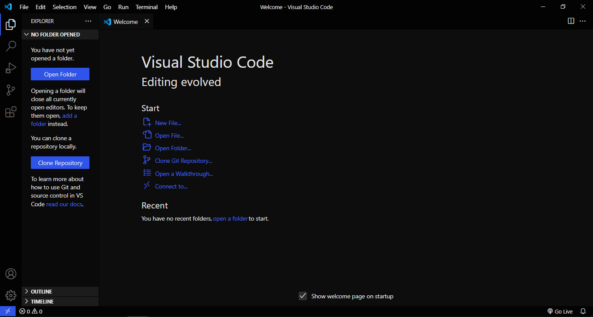

    
    <h1 align="center">Enhance Monokai</h1>

The dark and minimalist monokai-inspired theme for Visual Studio Code.
Remove the unnecessary borders and improve syntax highlighting colors.

## Installation

1. Open the **Extensions** sidebar on Visual Studio Code.
2. Search for **Enhance Monokai** theme.
3. Click **Install** to start the installation process.
4. Open the command palette with **Ctrl + Shift + P**.
5. Preferences: Color Theme > Select **Enhance Monokai**.

## Screenshots

## Contributing

**Enhance Monokai** theme are currently under development and improvement.
If you found any problem or have a future request, please open an
[**issue here**](https://github.com/syrizaldev/enhance-monokai/issues).
Thank you and have a nice day.

## License

[MIT License](./license)
