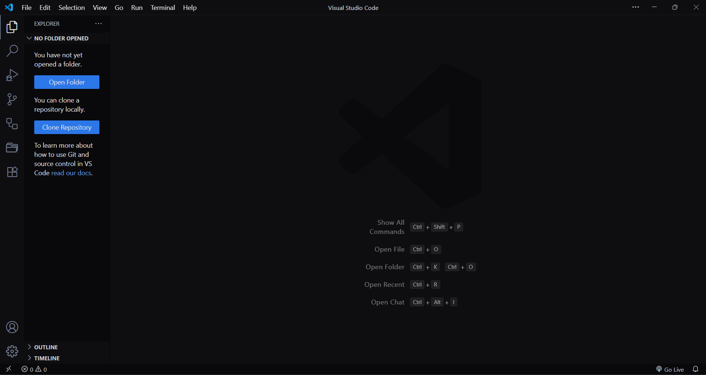
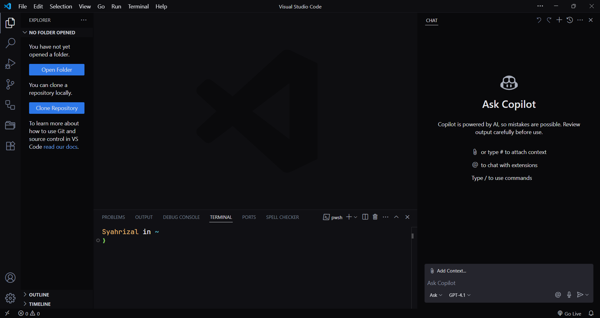

<p align="center">
    
    <h1 align="center">Monokai Midnight</h1>
</p>

Clean and minimalist monokai-inspired dark theme for Visual Studio Code.
Remove the unnecessary borders and improve the syntax highlighting colors.

## Installation

1. Open the **Extensions** sidebar on Visual Studio Code.
2. Search for **Monokai Midnight**.
3. Click **Install** to start the installation process.
4. Preferences > Theme > Color Theme > **Monokai Midnight**

## Optional Setting

```json
{
   "editor.fontSize": 16,
   "editor.lineHeight": 25,
   "editor.letterSpacing": 0.5,
   "editor.guides.bracketPairs": "active",
   "editor.bracketPairColorization.enabled": true
}
```

## Screenshots

<br><br>


## Contributing

**Monokai Midnight** theme is currently under development and improvement.
If you find any problem or have a future request, please open an
[**issue here**](https://github.com/syahrizaldev/monokai-midnight/issues).
Thank you for the contributions and have a nice day.

## License

This repository is licensed under the terms of the [**MIT License**](./license).
You can use, modify, and distribute this project under the license.

